# ResearchMind

An autonomous research agent built on **LangGraph**. Give it a topic, and it plans search queries, searches and scrapes the web, scores source credibility, analyzes sources and critiques its own work in a single LLM pass, and loops back to research further before synthesizing a structured report — all the way to a confidence-scored JSON output. It's tuned to run comfortably on the Gemini free tier: rate-limited LLM calls, per-run source/iteration caps, prompt trimming, and checkpointing so a run can resume after a crash or quota error.

## How it works

ResearchMind runs a cyclic LangGraph state machine. Each node mutates a shared `ResearchState` and the graph keeps looping between searching and analysis/critique until the research is deep enough (or it hits the iteration cap for the requested depth). Every node's output is checkpointed to disk, so an interrupted run resumes from its last completed phase instead of starting over.



### Pipeline stages

| Stage | Node | What happens |
|---|---|---|
| 1. Plan | `plan_searches` | Gemini generates N diverse search queries (capped by depth) from the topic, focus areas, prior queries, and any known knowledge gaps. |
| 2. Search | `execute_searches` | Tavily searches each query; pages are scraped if the snippet is too short, scored for credibility (low-credibility sources are dropped immediately), and chunked into the vector store — capped at the depth's max source count. |
| 3. Analyze + critique | `analyse_and_critique` | One LLM call does both jobs: extracts claims/evidence/confidence from all sources together (using ChromaDB context), identifies knowledge gaps and missing perspectives, and notes contradictions — merging new findings into the accumulated set by claim de-dup. |
| 4. Loop or finish | `should_loop_back` | If gaps remain and the iteration budget for the chosen depth (`shallow`=1, `medium`=2, `deep`=3) isn't exhausted, loop back to step 1; otherwise proceed. |
| 5. Synthesize | `synthesize_report` | Findings, gaps, and critique notes are synthesized into a final `ResearchReport`: summary, key findings, gaps, follow-up queries, overall confidence. Falls back to a minimal report if the LLM response fails to parse. |

Merging analysis and critique into one node (down from two separate LLM calls) roughly halves the LLM calls per iteration, which is the main lever for staying under the free-tier rate/daily limits.

## Project layout

```
research_mind/
├── main.py                  # CLI entrypoint (argparse) — builds/runs/resumes the graph
├── config.py                 # Free-tier limits: RPM, source/iteration caps, prompt budgets
├── graph/
│   ├── state.py              # ResearchState TypedDict shared across nodes
│   ├── nodes.py               # The 5 node functions described above
│   └── builder.py             # Wires nodes into the LangGraph StateGraph
├── models/
│   └── schemas.py             # Pydantic models: ResearchQuery, Finding, Source, ResearchReport
├── prompts/
│   └── researchers.py         # PLANNER / ANALYZER_CRITIQUE prompts
├── tools/
│   ├── search.py               # Tavily web search
│   ├── scrapper.py             # BeautifulSoup page scraping
│   ├── validator.py            # Domain-based credibility scoring + filtering
│   └── vector_store.py         # Chroma ingestion + semantic retrieval
├── utils/
│   ├── rate_limiter.py          # RateLimiterLLM: RPM throttling, quota backoff/retry, daily call count
│   ├── checkpoint.py             # Save/load/clear per-topic JSON checkpoints after each node
│   └── token_budget.py           # Prompt trimming, source batching, findings truncation helpers
├── checkpoints/                # Per-topic run state (created at runtime, cleared on success)
└── chroma_db/                 # Persisted vector store (created at runtime)
```

## Data model

- **`ResearchQuery`** — input: `topic`, `depth` (`shallow`/`medium`/`deep`), `focus_areas`, `exclude_domains`
- **`Source`** — `url`, `title`, `content`, `credibility_score`, `relevance_score`, `chunk_ids`
- **`Finding`** — `claim`, `evidence`, `source_urls`, `confidence`, `contradictions`
- **`ResearchReport`** — `topic`, `summary`, `key_findings`, `sources`, `gaps_identified`, `follow_up_queries`, `word_count`, `confidence_overall`

## Source credibility

`tools/validator.py` scores each domain heuristically: trusted domains (`nature.com`, `pubmed`, `arxiv`, `wikipedia`, `reuters`, `techcrunch`, `wired`, ...) get a base boost, penalized domains (`reddit`, `quora`, `yahoo`) get a deduction, and longer content gets a small bonus. Sources scoring below `MIN_CREDIBILITY` (0.35) are dropped during search, before they ever reach the vector store or an LLM call.

## Semantic memory

Scraped content is chunked (`chunk_size=800`, `overlap=100`) and embedded with `sentence-transformers/all-MiniLM-L6-v2` into a persistent **ChromaDB** collection (`./chroma_db`). During analysis, related chunks already in the store are pulled in as extra context, giving the LLM cross-source signal without re-fetching pages.

## Free-tier rate limiting

`utils/rate_limiter.py` wraps the Gemini client (`google.genai`) in a `RateLimiterLLM` singleton shared by every node:

- Enforces a minimum gap between calls (`SAFE_RPM=10`, i.e. one call every 6s — comfortably under the 15 RPM free-tier limit).
- Retries on quota errors (`429`/`RESOURCE_EXHAUSTED`) with exponential backoff + jitter, parsing a retry-after hint from the error message when present.
- Tracks an approximate daily call count in `.daily_file.json`, surfaced in the CLI output so you can watch usage against `MAX_LLM_CALLS_PER_DAY` (`config.py`).

`utils/token_budget.py` keeps prompts small: it trims prompt text to per-node character budgets (`config.PROMPT_BUDGET`), caps how many sources/findings are stuffed into a single prompt, and batches sources into a compact text block instead of raw JSON.

Together with merging analysis+critique into one node and capping sources/iterations per depth (`config.MAX_SOURCES`, `config.MAX_ITERATIONS`), a `shallow` run costs ~3 LLM calls, `medium` ~5, `deep` ~7.

## Checkpointing & resume

`utils/checkpoint.py` writes the full state to `./checkpoints/<topic-slug>.json` after every node finishes. If a run is interrupted (crash, quota exhaustion, Ctrl-C), re-running with the same topic string picks up from the last completed phase instead of restarting research from scratch. Checkpoints are cleared automatically on successful completion, and can be inspected with `python main.py --list-checkpoints`.

## Setup

```bash
uv sync   # or: pip install -r requirements.txt
```

Create a `.env` file with:

```
GOOGLE_API_KEY=your_gemini_api_key
TAVILY_API_KEY=your_tavily_api_key
```

## Usage

```bash
python main.py "impact of large language models on scientific research"
python main.py "impact of large language models on scientific research" --depth deep
python main.py "impact of large language models on scientific research" --depth shallow --focus ethics policy
python main.py --list-checkpoints
```

This streams progress to the terminal (via `rich`), then prints a rendered summary table (sources, findings, confidence, word count, LLM calls used) and writes the full report to `report_<topic>.json`.

## Tech stack

- **Orchestration**: LangGraph (`langgraph`)
- **LLM**: Google Gemini
- **Search**: Tavily API
- **Scraping**: BeautifulSoup4 + httpx
- **Vector store**: ChromaDB + `sentence-transformers`
- **Schemas**: Pydantic
- **CLI output**: Rich


