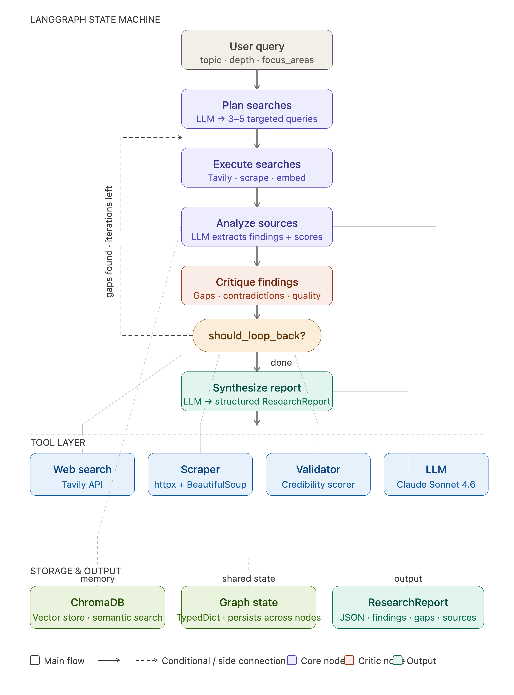

# ResearchMind

An autonomous research agent built on **LangGraph**. Give it a topic, and it plans search queries, searches and scrapes the web, scores source credibility, extracts findings with an LLM, critiques its own work for gaps and bias, and loops back to research further before synthesizing a structured report — all the way to a confidence-scored JSON output.

## How it works

ResearchMind runs a cyclic LangGraph state machine. Each node mutates a shared `ResearchState` and the graph keeps looping between searching and critiquing until the research is deep enough (or it hits the iteration cap for the requested depth).



### Pipeline stages

| Stage | Node | What happens |
|---|---|---|
| 1. Plan | `plan_searches` | Gemini generates 3–5 diverse search queries from the topic, focus areas, prior queries, and any known knowledge gaps. |
| 2. Search | `execute_searches` | Tavily searches each query; pages are scraped if the snippet is too short, scored for credibility, and chunked into the vector store. |
| 3. Analyze | `analyse_sources` | For each credible source, related chunks are pulled from ChromaDB for context, then an LLM extracts claims, evidence, confidence, and contradictions. |
| 4. Critique | `critique_findings` | An LLM reviews accumulated findings for logical inconsistencies, missing perspectives, and source bias, and lists remaining knowledge gaps. |
| 5. Loop or finish | `should_loop_back` | If gaps remain and the iteration budget for the chosen depth (`shallow`=1, `medium`=2, `deep`=3) isn't exhausted, loop back to step 1; otherwise proceed. |
| 6. Synthesize | `synthesize_report` | Findings are deduplicated and merged into a final `ResearchReport`: summary, key findings, consensus/controversy, gaps, follow-up queries, overall confidence. |

## Project layout

```
research_mind/
├── main.py                 # CLI entrypoint — builds and runs the graph
├── config.py                # (reserved for centralized settings)
├── graph/
│   ├── state.py             # ResearchState TypedDict shared across nodes
│   ├── nodes.py              # The 6 node functions described above
│   └── builder.py            # Wires nodes into the LangGraph StateGraph
├── models/
│   └── schemas.py            # Pydantic models: ResearchQuery, Finding, Source, ResearchReport
├── prompts/
│   └── researchers.py        # PLANNER / ANALYZER / CRITIQUE system prompts
├── tools/
│   ├── search.py              # Tavily web search
│   ├── scrapper.py            # BeautifulSoup page scraping
│   ├── validator.py           # Domain-based credibility scoring
│   └── vector_store.py        # Chroma ingestion + semantic retrieval
└── chroma_db/                # Persisted vector store (created at runtime)
```

## Data model

- **`ResearchQuery`** — input: `topic`, `depth` (`shallow`/`medium`/`deep`), `focus_areas`, `exclude_domains`
- **`Source`** — `url`, `title`, `content`, `credibility_score`, `relevance_score`, `chunk_ids`
- **`Finding`** — `claim`, `evidence`, `source_urls`, `confidence`, `contradictions`
- **`ResearchReport`** — `topic`, `summary`, `key_findings`, `sources`, `gaps_identified`, `follow_up_queries`, `word_count`, `confidence_overall`

## Source credibility

`tools/validator.py` scores each domain heuristically: trusted domains (`nature.com`, `pubmed`, `arxiv`, `wikipedia`, `reuters`, ...) get a base boost, penalized domains (`reddit`, `quora`) get a deduction, and bonuses apply for citations, named authorship, and longer content. Only sources above the credibility threshold feed into analysis.

## Semantic memory

Scraped content is chunked (`chunk_size=800`, `overlap=100`) and embedded with `sentence-transformers/all-MiniLM-L6-v2` into a persistent **ChromaDB** collection (`./chroma_db`). During analysis, each source is paired with related chunks already in the store, giving the LLM cross-source context without re-fetching pages.

## Setup

```bash
uv sync   # or: pip install -r requirements.txt
```

Create a `.env` file with:

```
GOOGLE_API_KEY=your_gemini_api_key
TAVILY_API_KEY=your_tavily_api_key
```

## Usage

```bash
python main.py "impact of large language models on scientific research"
```

This streams progress to the terminal (via `rich`), then prints a rendered summary and writes the full report to `report_<topic>.json`.

## Tech stack

- **Orchestration**: LangGraph (`langgraph`)
- **LLM**: Google Gemini via `langchain-google-genai` (Anthropic/Groq integrations also available)
- **Search**: Tavily API
- **Scraping**: BeautifulSoup4 + httpx
- **Vector store**: ChromaDB + `sentence-transformers`
- **Schemas**: Pydantic
- **CLI output**: Rich


